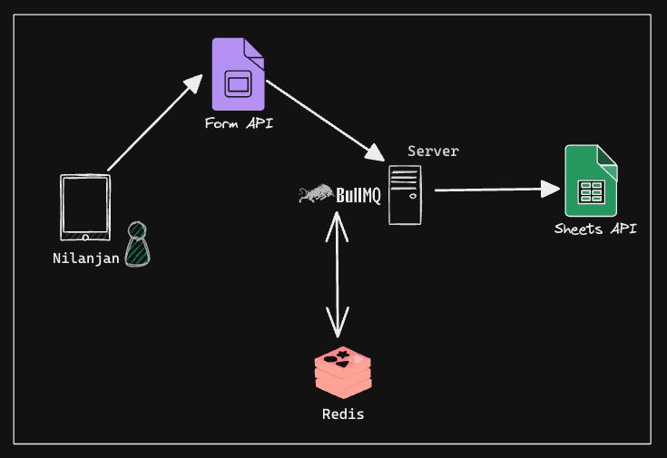
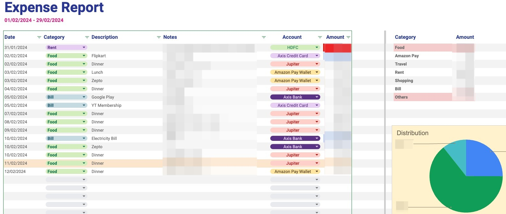

## My Personal Expense Tracker

### Motivation

After my graduation, I started working and earning money. I was always curious about how much I was spending and how much I was saving. I wanted to keep track of my expenses and savings. Then I tried some apps on the play store but I didn't like them. Then I started maintaining a Google Sheet for my Expenses (Monthly) and my Savings. I was putting entries every two or three weeks. Initially I only have one Single Bank account, so I was downloading the statement and then putting the entries in the Google Sheet. But it was getting difficult when I opened another bank account and started using a Credit Card.

Then I created a Google Form where I manually put the entries and then by replaying those responses, I was putting the entries in the Google Sheet. The reason for manually putting entries was that I wanted to keep track of my expenses and savings in a more detailed way and monthly distribution of expenses and savings. I don't a excel guy so I was not able to automate the process where responses automatically go to the desired sheet in the Google Sheet eg. February 2024 expenses should go to the February 24 sheet.

Then I thought of creating a simple scheduler which read my responses and put those entries on appropriate sheet. There was an advantage of using Google Products as google provides very well documented apis to interact with their products.

### Tech Stack

- NodeJS - Backend was written in NodeJS
- [Google Sheets API](https://developers.google.com/sheets/api/reference/rest) - To interact with Google Sheets
- [Google Forms API](https://developers.google.com/forms/api/reference/rest) - To interact with Google Forms
- [BullMQ](https://docs.bullmq.io/) - To create a simple scheduler
- [Redis](https://redis.io/) - To store the jobs in the queue
- [Railway](https://railway.app/) - To deploy the application

### How it works

- Created a Google Form where I put the entries of my expenses and savings.
- Created a Google Sheet where I put the entries of my expenses and savings.
- I fill my expense entry on the Google Form and submit it.
- The response of the Google Form is read by the application periodically (every 3 hours).
- The application then puts the entries in the Google Sheets.

### Architecture

### Demos

---

Made with ❤️ by [nil1729](https://github.com/nil1729)
